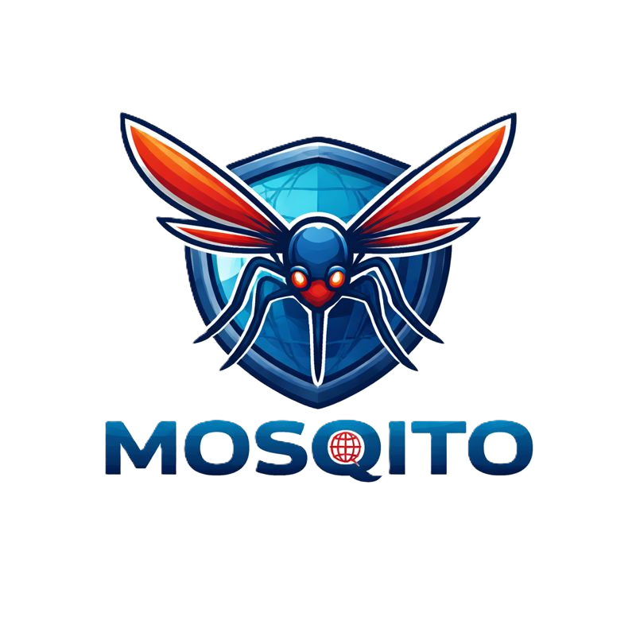

# Mosqito 🦟




**Mosqito is a defensive cybersecurity tool for detecting Unicode homoglyph and IDN-based domain impersonation and phishing risks.**

---

## Overview

Unicode homoglyphs are frequently abused in phishing and brand impersonation attacks by replacing ASCII characters with visually similar Unicode characters.

Mosqito helps security professionals:
- Detect Unicode-based domain masquerading
- Generate potential homoglyph impersonation variants
- Analyze suspicious domains during SOC triage
- Understand IDN and Punycode abuse techniques

Mosqito is designed **strictly for defensive security research, detection engineering, and education**.

---

## Features

- Unicode homoglyph domain variant generation
- Masquerade detection for single domains
- Visual normalization and impersonation detection
- Risk scoring for prioritization
- IDN / Punycode identification
- Colorized terminal output
  - 🟢 Green: clean / low risk
  - 🟠 Orange: suspicious / malicious-looking
- Single-file, dependency-free Python tool

---

## Installation

Clone the repository:

```bash
git clone https://github.com/zrnge/Mosqito.git
cd Mosqito
```

## Disclaimer

Mosqito is intended **solely for defensive cybersecurity research, education, and detection engineering**.

It must **not** be used for phishing, impersonation, fraud, or any malicious activity.
The authors assume no responsibility for misuse of this tool.

Use responsibly and in compliance with applicable laws and policies.

